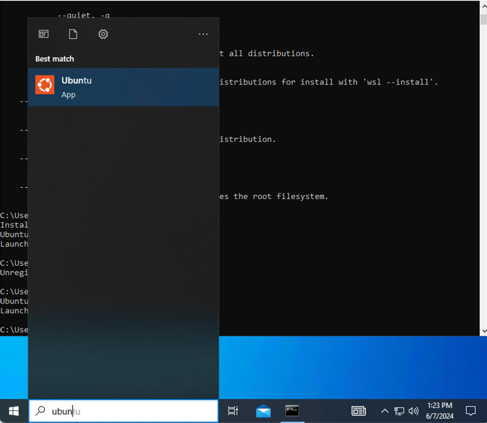

# OSeMOSYS Global Installation Instructions
## Reset your WSL 
To reset WSL, run command below in your CMD window.
```
wsl --unregister ubuntu
```
When the following window is showed up, set up your user name and password as simple as possible.

## Install essential packages
Run the following codes.
```
sudo apt-get update && sudo apt-get install -y python3 python3-pip glpk-utils coinor-cbc coinor-libcbc-dev 
```

## Install miniconda

Follow the instructions in this [page](https://docs.anaconda.com/free/miniconda/)  
OR  
Run the following codes in your Ubuntu window.

```
mkdir -p ~/miniconda3
wget https://repo.anaconda.com/miniconda/Miniconda3-latest-Linux-x86_64.sh -O ~/miniconda3/miniconda.sh
bash ~/miniconda3/miniconda.sh -b -u -p ~/miniconda3
rm -rf ~/miniconda3/miniconda.sh
```
After installing, initialize your newly-installed Miniconda. The following commands initialize for bash and zsh shells:
```
~/miniconda3/bin/conda init bash
~/miniconda3/bin/conda init zsh
```
Then, turn off and on Ubuntu window. 


## Clone git repository

```
git clone --recurse-submodules https://github.com/OSeMOSYS/osemosys_global.git 
cd osemosys_global
conda env create -f workflow/envs/osemosys-global.yaml 
```

## Set-up your timeslice and country
Open `\\wsl.localhost\Ubuntu\home\LINUX_USERNAME\osemosys_global\config\config.yaml` file and edit the set-ups.  
